# Top 17 Best Yoga Clothing Brands in 2025

Finding yoga wear that actually moves with your body instead of fighting it can feel like searching for enlightenment itself. You want leggings that won't slide down mid-downward dog, sports bras that provide real support, and fabrics soft enough to wear from morning flow to afternoon coffee runs. The yoga activewear market has exploded with options promising buttery softness and studio-to-street versatility, but which brands genuinely deliver on comfort, durability, and that elusive "second skin" feel without breaking your budget?

This collection brings together the most trusted names in yoga apparel—from heritage brands perfecting their craft since 2005 to innovative newcomers using recycled materials and sustainable practices. Whether you're after high-compression leggings for hot yoga sessions, loungewear-friendly basics for gentle flows, or bold prints that make you feel fearless, these brands have built their reputations on moving bodies through every asana.

## **[Beyond Yoga](https://beyondyoga.com)**

The go-to choice for yogis who prioritize buttery softness above everything else.

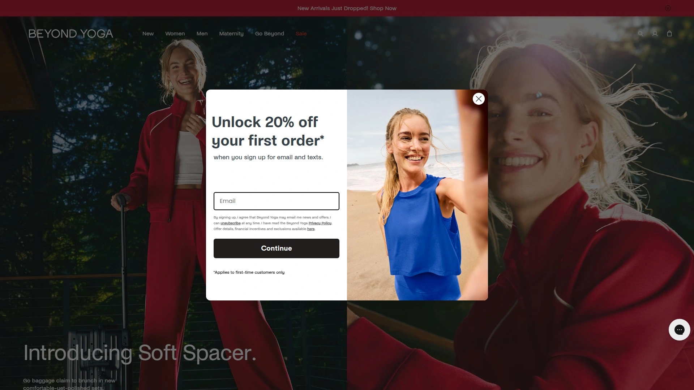

Beyond Yoga has been a female-founded leader since 2005, building its entire identity around one core promise: activewear that feels like a warm hug. Their signature Spacedye fabric delivers that coveted second-skin sensation without sacrificing support, making these pieces as suitable for intense vinyasa flows as they are for Netflix marathons.

What sets them apart is their commitment to inclusive sizing and body diversity—every design gets tested across different body types to ensure flattering fits that actually stay put during movement. The brand's matching sets have become Instagram staples, but the real magic lies in how their high-waisted leggings maintain compression without creating muffin tops or requiring constant adjustments.

**Best for:** Anyone seeking loungewear-level comfort with genuine workout functionality, plus those who appreciate size inclusivity and softer, less aggressive athleisure aesthetics.

## **[Lululemon](https://www.lululemon.com)**

Premium performance wear with cult-favorite leggings that have defined modern yoga fashion.

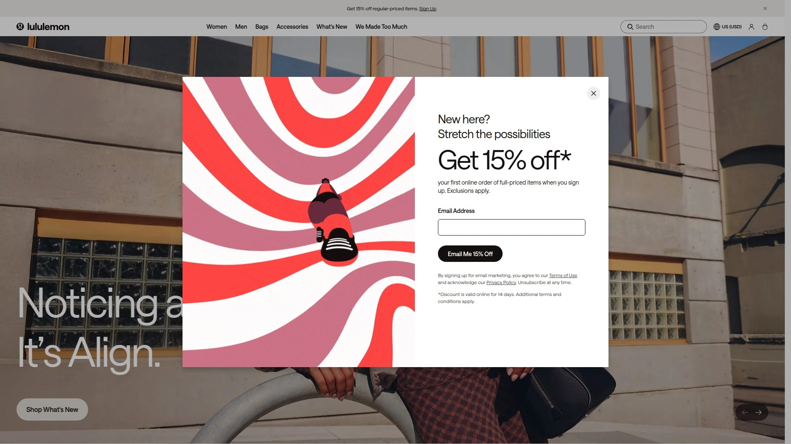

Lululemon practically invented the luxury activewear category and continues setting industry standards with fabrics engineered for serious athletes. Their Align leggings feature Nulu fabric technology that creates a weightless, buttery texture while maintaining opacity through the deepest squats—a combination that's earned them near-religious devotion from yoga practitioners.

The brand invests heavily in fabric innovation, developing proprietary materials like Everlux for sweat-wicking and Luxtreme for compression that feels supportive without restrictive. While price points sit firmly in premium territory, the durability justifies the investment—these pieces maintain shape and color integrity through years of regular wear and washing.

Lululemon's retail locations offer free hemming services and detailed fit consultations, plus their community-building approach includes free yoga classes at many stores, creating an ecosystem beyond just clothing.

## **[Alo Yoga](https://www.aloyoga.com)**

Fashion-forward designs that transition seamlessly from studio to street with influencer-approved style.

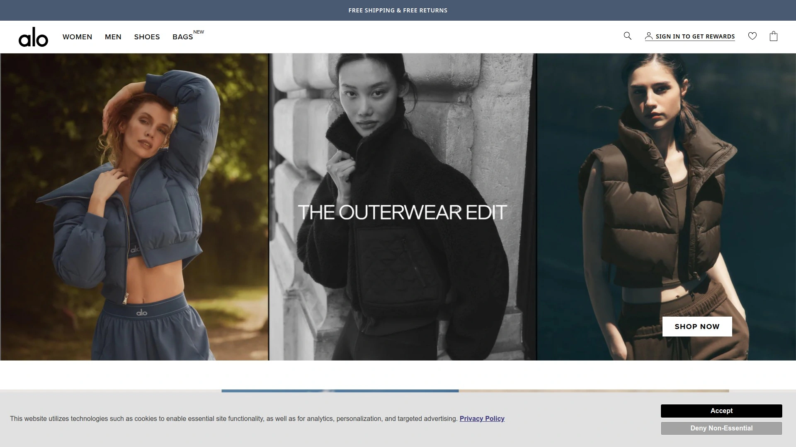

Alo Yoga has mastered the art of creating activewear that looks expensive and feels luxurious, with their signature Airlift leggings featuring ultra-smooth fabric with just enough sheen to elevate any outfit. Based in Los Angeles, the brand channels California cool through minimalist cuts, neutral color palettes, and occasional bold accent pieces that photograph beautifully.

Their product range extends beyond yoga into lifestyle wellness, offering haircare, skincare, and home essentials that align with the yoga philosophy of holistic self-care. The brand's matching sets have become uniform-level popular among Pilates enthusiasts and yoga instructors who want cohesive, polished looks without sacrificing movement functionality.

Alo's Accolade fabric line provides targeted compression zones that sculpt without restricting blood flow, while their loungewear collections use French terry and cloud-soft knits perfect for post-practice relaxation.

## **[Athleta](https://www.athleta.com)**

Inclusive sizing meets sustainable practices in versatile yoga wear designed for active lifestyles.

Athleta distinguishes itself through comprehensive size ranges (often extending to XXS-3X) and unwavering commitment to sustainable manufacturing processes. Their Salutation collection has become the brand's backbone—high-waisted tights with hidden pockets that actually fit phones, made from moisture-wicking PowerVita fabric that maintains compression through countless wash cycles.

The brand pioneered the "Power of She" movement, creating activewear that celebrates women's strength rather than focusing solely on aesthetics. This philosophy translates into practical design choices: reinforced waistbands that don't roll, gussets for full range of motion, and bra designs with adjustable features for customized support levels.

Athleta's sustainability initiatives include using recycled polyester, organic cotton, and TENCEL materials, plus they've committed to Fair Trade certification across production facilities. Their pieces work beautifully for yoga but translate equally well to running errands, hiking trails, or strength training sessions.

## **[Prana](https://www.prana.com)**

Eco-conscious yoga clothing combining sustainable materials with functional outdoor performance.

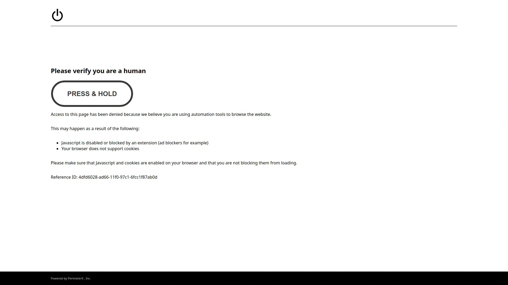

Prana treats yoga wear as serious outdoor gear, using recycled nylon, organic cotton, and hemp blends that withstand both intense practice and natural elements. Their Transform leggings showcase this approach—high-rise waists, recycled materials, and construction quality that rivals technical hiking apparel.

As a bluesign systems partner, Prana ensures their fabrics meet strict non-toxic standards, making them safe for sensitive skin and environmentally responsible. The brand has helped 11 factories obtain Fair Trade certification and actively works toward producing all garments in Fair Trade-certified facilities, paying into worker premium funds.

Their yoga clothing embraces earthy tones and subtle patterns inspired by natural landscapes, with pieces designed to flow between yoga studios, coffee shops, and outdoor adventures without requiring outfit changes. The Heavana collection offers pocket leggings and racerback bralettes in heathered fabrics that disguise sweat while maintaining breathability.

## **[Manduka](https://www.manduka.com)**

Premium eco-friendly apparel from the yoga mat experts, built for conscious practitioners.

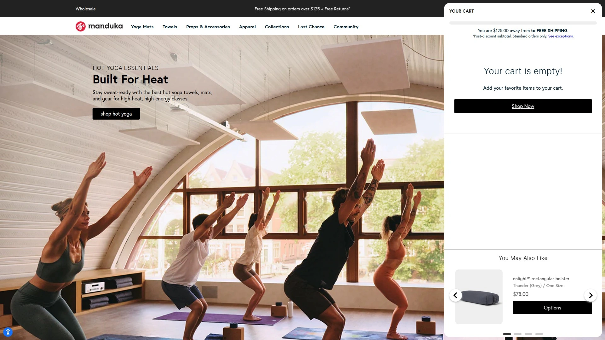

Manduka leveraged their reputation as the gold standard in yoga mats to create equally thoughtful activewear using OEKO-TEX certified recycled synthetics and organic cotton. Their Essential High Line leggings deliver sustainable construction without compromising on the compression and support serious yogis demand.

The brand's eco-initiatives extend beyond materials—they've developed zero-waste manufacturing processes for their eKO mat line and zero-emission protocols for PRO series products, demonstrating environmental commitment across all product categories. Their LiveOn program accepts old yoga mats from any brand and transforms them into home insulation materials through The Renewable Workshop.

While Manduka's clothing line remains smaller than their mat collection, each piece gets carefully curated for functionality and sustainability. The Cross Strap bra exemplifies their minimalist approach—light support, clean lines, and construction that prioritizes comfort during meditation and restorative practices over high-impact activities.

## **[Girlfriend Collective](https://www.girlfriend-collective.com)**

Vibrant, sustainable activewear made from recycled materials at accessible price points.

Girlfriend Collective proves eco-friendly doesn't mean boring, offering their signature compressive leggings in rainbow hues while maintaining their commitment to using recycled plastic bottles and fishing nets. Each pair of their Compressive High-Rise leggings contains approximately 25 recycled water bottles, transformed into stretchy, supportive fabric that rivals virgin polyester blends.

The brand operates with radical transparency, openly sharing factory information, production costs, and environmental impact data on their website. Their size range extends from XXS to 6XL, making trendy activewear accessible to bodies typically excluded from fashion-forward athletic brands.

The Paloma bra doubles as a longline crop top, showcasing their design philosophy of versatile pieces that work for yoga, barre, Pilates, or casual weekend wear. Girlfriend Collective's price points hover in the mid-range category, making sustainable choices achievable without luxury brand budgets.

## **[Vuori](https://www.vuori.com)**

Laid-back California-inspired performance wear with lightweight fabrics perfect for sweaty sessions.

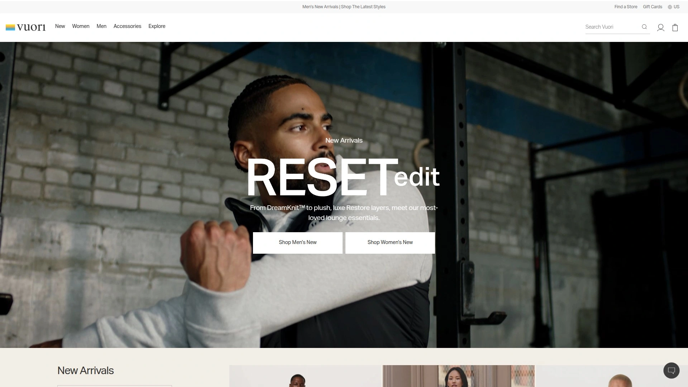

Vuori channels beach town energy through relaxed silhouettes and technical fabrics engineered for moisture management. Their Daily Legging has become a cult favorite for its quick-drying properties and versatile styling—suitable for hot yoga classes, beachside runs, or airport travel days.

The brand targets the intersection between serious athletes and lifestyle enthusiasts, creating pieces that perform during workouts but never look overly technical or aggressive. The Halo Performance crop top exemplifies this balance with its relaxed fit that skims the body without clinging, made from breathable fabric that manages sweat without showing every drop.

Vuori's men's line receives equal attention to their women's collection, making them a go-to choice for couples seeking coordinated activewear aesthetics. Their fabric choices prioritize weightless feels and four-way stretch, allowing unrestricted movement through yoga flows, surfing sessions, or casual hiking.

## **[Outdoor Voices](https://www.outdoorvoices.com)**

Playful color-blocking and "Doing Things" philosophy encouraging everyday movement.

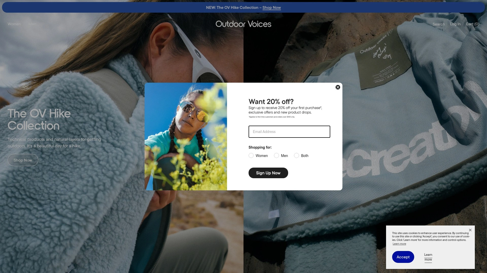

Outdoor Voices rejects the "no pain, no gain" mentality, instead celebrating recreational exercise and joyful movement through their signature color-blocked designs. The TechSweat leggings feature strategic mesh panels for breathability while their Doing Things bra offers comfortable, cute support for light to medium impact activities.

The brand's aesthetic leans heavily into block colors, two-tone combinations, and retro-inspired athletic details that photograph beautifully for social media content. Their matching exercise sets have become instantly recognizable, often spotted in urban parks during weekend group runs or outdoor yoga sessions.

Outdoor Voices positions themselves as the antidote to intimidating gym culture, creating activewear for people who view movement as a lifestyle rather than punishment. This philosophy translates into forgiving fits, fun styling options, and marketing that features real humans rather than exclusively elite athletes.

## **[Sweaty Betty](https://www.sweatybetty.com)**

UK-based brand combining high-performance fabrics with bold prints and sculpting fits.

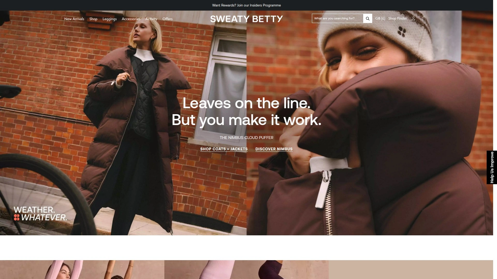

Sweaty Betty approaches yoga wear with European sensibilities, favoring bold patterns, jewel tones, and design details that make statements. Their Power leggings offer genuine sculpting compression with strategically placed seams that create flattering silhouettes, plus practical side pockets large enough for phones.

The brand's fabric choices prioritize performance—their proprietary blends wick sweat efficiently while maintaining opacity and shape retention through high-heat yoga classes and intense training sessions. The Stamina sports bra showcases their attention to yoga-specific needs with its lightweight construction and minimal hardware that won't dig into skin during floor poses.

Sweaty Betty's UK origins influence their aesthetic, bringing a slightly different energy than California-based brands—think bold florals, animal prints, and color combinations that embrace maximalism rather than minimalist neutrals. They've expanded globally while maintaining their distinctive European approach to activewear styling.

## **[Spiritual Gangster](https://spiritualgangster.com)**

Positive-message apparel combining yoga wear with conscious lifestyle branding.

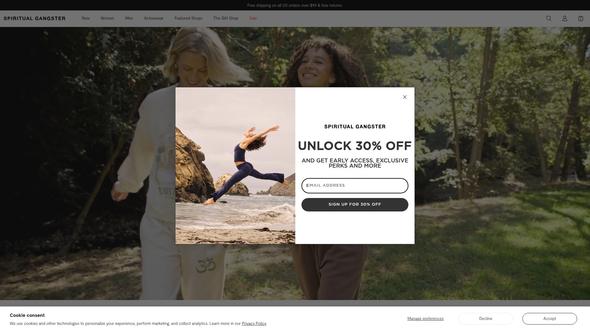

Spiritual Gangster built their brand around uplifting mantras and charitable giving, printing inspirational messages across comfortable activewear pieces. Their clothing serves dual purposes—functional yoga wear and wearable reminders of mindfulness practices, with phrases like "Good Vibes" and "Namaste" incorporated into designs.

The brand donates meals through Feeding America with each purchase, connecting activewear consumption to social responsibility. This mission-driven approach appeals to yogis seeking brands that align with spiritual values beyond just eco-friendly materials.

Their product range includes yoga leggings, loungewear, accessories, and lifestyle pieces that work for practice and casual wear. The aesthetic leans boho-chic with flowing silhouettes, soft fabrics, and earthy color palettes punctuated by occasional bright accent pieces.

## **[Fabletics](https://www.fabletics.com)**

Affordable activewear with membership pricing offering quality basics at accessible costs.

Fabletics disrupted the activewear market by offering high-quality leggings, sports bras, and workout tops at price points significantly lower than premium brands. Their membership model allows subscribers to access discounted pricing on new releases, making trend-current activewear affordable for budget-conscious yogis.

The brand's PowerHold fabric provides compression comparable to luxury leggings while maintaining a sub-$50 price point for members. Their extensive size range (XXS-4X) and frequent new releases mean fresh options appear monthly across various styles—high-waisted, cropped, flared, and bootcut.

Fabletics offers both women's and men's collections with matching sets, outerwear, and seasonal pieces beyond just leggings and sports bras. While purists might notice fabric differences compared to Lululemon or Alo, the quality-to-price ratio makes them excellent for building a workout wardrobe without investment-level spending.

## **[Onzie](https://www.onzie.com)**

Venice Beach brand featuring Free-Flow fabric technology and vibrant, body-positive designs.

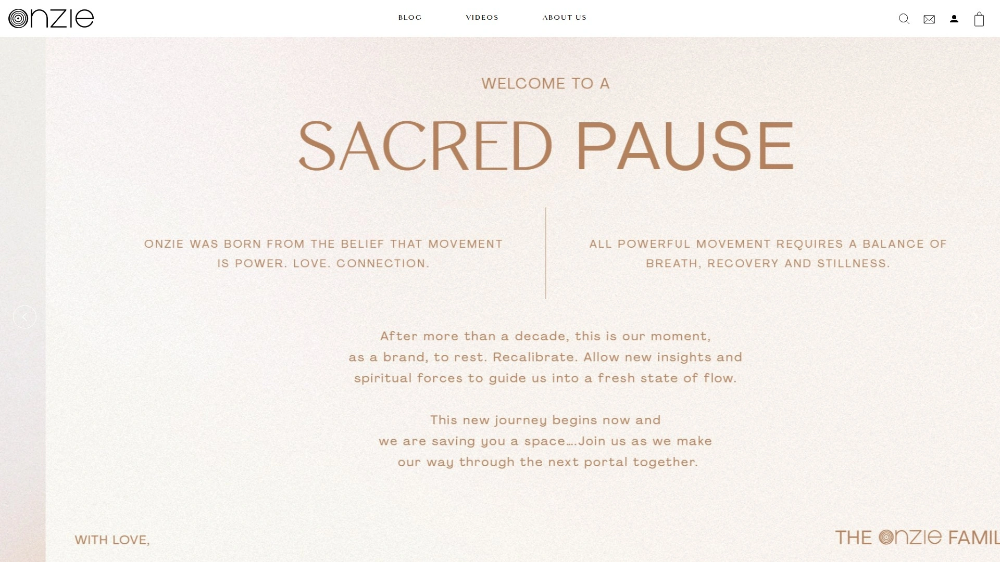

Onzie emerged from Venice Beach's yoga scene in 2010, creating activewear that celebrates body diversity and fearless self-expression through bold prints and forgiving fits. Their Free-Flow fabric technology allows pieces to be worn in water—whether salt, chlorine, or heavy sweat—while drying remarkably fast.

The brand has earned celebrity endorsement (Lady Gaga reportedly wears Onzie for Bikram yoga) while maintaining accessible pricing and size-inclusive ranges. Their designs embrace pattern maximalism with tie-dye, geometric prints, and color combinations that make visual statements in any studio.

Onzie's construction prioritizes durability—pieces maintain shape and elasticity through countless washes and high-heat practice sessions. The brand respects "the movement of the body," designing around flexibility needs rather than fashion trends, with women running the entire operation.

## **[Teeki](https://www.teekiboutique.com)**

Eco-warrior brand transforming recycled plastic bottles into wild-printed yoga leggings.

Teeki has revolutionized sustainable activewear by creating every pair of pants from approximately 25 recycled plastic bottles through a complex five-step process. They've proven eco-friendly can be eye-catching, offering wacky prints and bold patterns that make sustainability exciting rather than virtuous sacrifice.

Made entirely in the United States using solar-powered facilities, Teeki controls their entire production chain for maximum environmental responsibility. Their hot pants (leggings) come in exclusive patterns that, once sold out, never get repeated—making each design truly limited edition.

The brand's website allows shoppers to search by pattern preferences rather than just garment types, acknowledging that print selection often drives purchasing decisions for yoga wear. Teeki's commitment extends beyond materials to production methods, creating activewear that genuinely walks the eco-friendly talk.

## **[Carbon38](https://carbon38.com)**

Curated performance fashion retailer offering high-fashion activewear and exclusive collections.

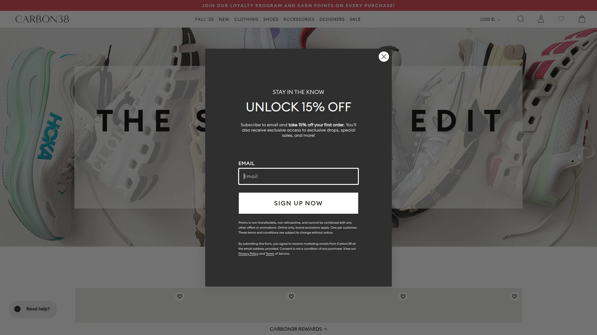

Carbon38 operates as both brand and curator, creating their own exclusive fabrics (like the buttery Melt line and supportive Diamond Compression) while stocking carefully selected designers from around the globe. Their aesthetic leans heavily into fashion-meets-function, treating activewear as legitimate ready-to-wear rather than just gym clothing.

The brand's exclusive collections feature thoughtful design details—split bootcut leggings, mesh overlay bras, and multi-strap constructions that photograph beautifully while providing genuine performance benefits. Their Melt fabric delivers second-skin fits with weightless, sculpting properties that rival any luxury brand's proprietary blends.

Carbon38's curation includes pieces from Adidas by Stella McCartney, Norma Kamali, and emerging designers, creating a one-stop destination for trend-conscious yogis seeking variety beyond single-brand shopping. Price points reflect premium positioning, but the unique designs and fabric quality justify investment for those seeking activewear that makes fashion statements.

## **[Splits59](https://www.splits59.com)**

Performance-driven women's activewear combining technical fabrics with flattering silhouettes.

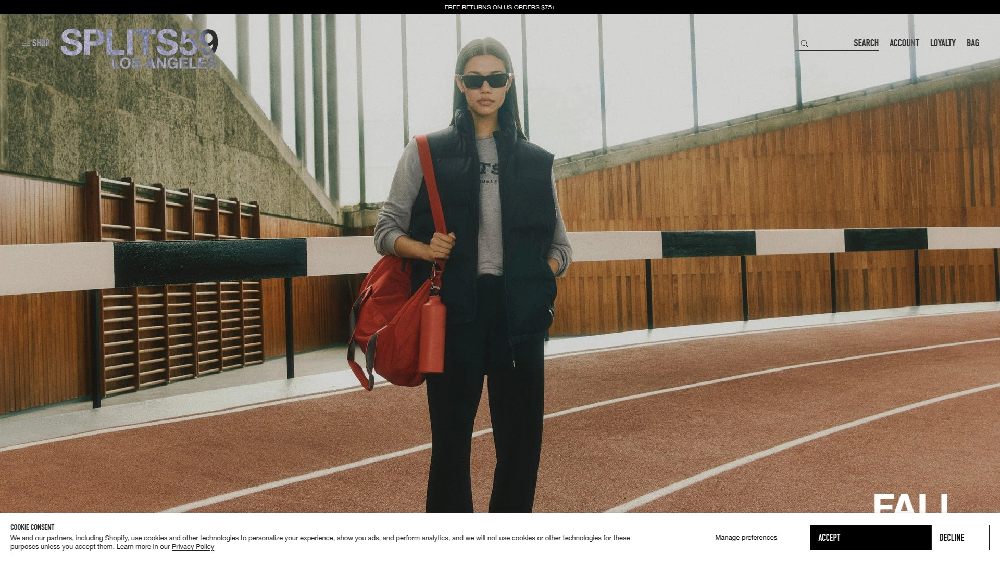

Splits59 focuses exclusively on women's workout apparel, creating pieces that balance athletic performance with feminine aesthetics through thoughtful cuts and fabric choices. Their Raquel flare yoga pants have developed cult followings for their leg-lengthening silhouettes and comfortable waistbands that stay secure during inversions.

The brand's technical approach shows in their fabric selection—quick-drying, moisture-wicking blends that manage sweat without showing wet spots or losing compression when damp. Their leggings collection spans various rises, lengths, and compression levels, acknowledging that different body types and practice styles require different specifications.

Splits59 maintains free 30-day returns, allowing customers to truly test pieces through multiple practices before committing. The brand gets frequently mentioned in "lesser-known favorites" threads by activewear enthusiasts who've discovered their quality-to-visibility ratio.

## **[Yoga Democracy](https://www.yogademocracy.com)**

Democratic pricing meets eco-friendly production in vibrant, accessible yoga wear.

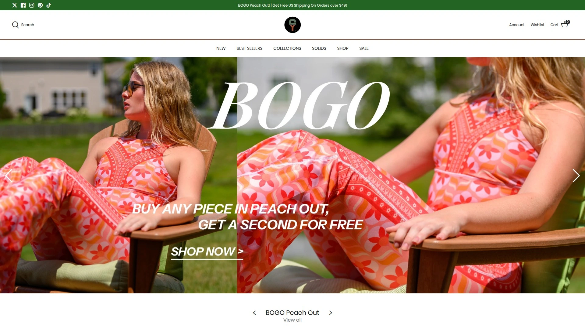

Yoga Democracy champions the philosophy that sustainable, high-quality activewear shouldn't require luxury budgets, offering eco-friendly pieces at mid-range price points. Their commitment to environmental responsibility shows through fabric choices and production methods that minimize waste while maximizing durability.

The brand's designs embrace color and pattern, proving eco-conscious doesn't mean aesthetically boring. Their inclusive approach extends beyond pricing to size ranges and body-positive marketing that features real yogis rather than exclusively model-perfect bodies.

Yoga Democracy positions sustainability as baseline expectation rather than premium feature, working to normalize eco-friendly practices across the activewear industry. Their pieces work for yoga, Pilates, barre, and everyday athleisure without breaking budgets or compromising values.

## **[Ripple Yoga Wear](https://rippleyogawear.com)**

Organic and natural fabric specialists creating gentle, earth-friendly yoga clothing.

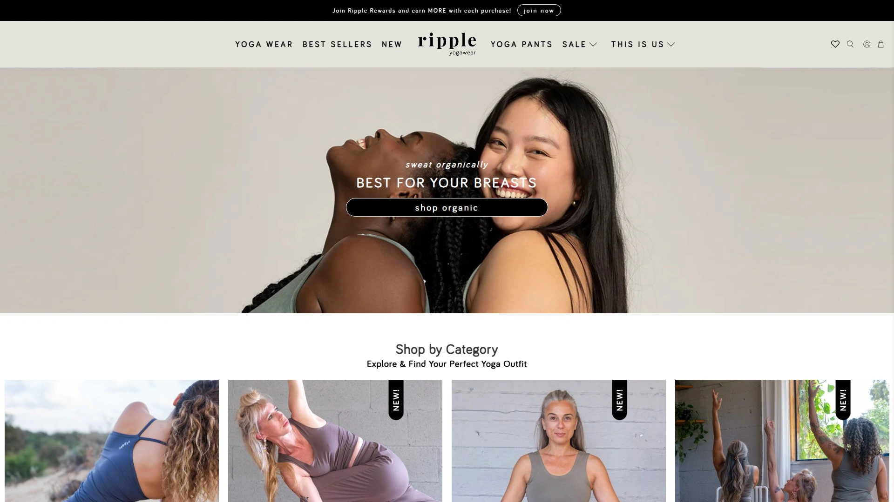

Ripple Yoga Wear takes eco-consciousness to the next level by prioritizing organic and natural fabrics over even recycled synthetics. Their pieces feel softer and more breathable than polyester blends, appealing to yogis with sensitive skin or those seeking fabrics that align with natural living philosophies.

The brand's commitment to organic materials means their environmental impact begins at the farming level, supporting agricultural practices that build soil health rather than depleting resources. While organic fabrics sometimes lack the compression and sweat-wicking properties of technical synthetics, Ripple's designs work beautifully for gentle yoga styles, meditation practices, and restorative sessions.

Their aesthetic embraces simplicity and nature-inspired tones, creating clothing that feels aligned with yoga's philosophical roots. Ripple appeals particularly to practitioners seeking minimal processing, natural fiber content, and brands operating at smaller scales with transparent production practices.

---

## FAQ

**What makes yoga clothing different from regular activewear?**

Yoga clothing prioritizes four-way stretch for unrestricted movement through poses, flat seams that won't irritate during floor work, and high-waisted designs that stay put during inversions. Unlike running gear focused on forward motion, yoga wear must accommodate twisting, bending, and extreme flexibility without restricting range or creating uncomfortable bunching.

**How do I choose between budget and premium yoga brands?**

Consider frequency of practice and specific needs—if you practice daily or attend heated classes, investing in premium fabrics from brands like Lululemon or Alo Yoga offers better durability and sweat management. For occasional practitioners or those building initial wardrobes, mid-range brands like Fabletics, Girlfriend Collective, or Yoga Democracy provide excellent quality-to-cost ratios without sacrificing functionality.

**Do sustainable yoga brands actually perform as well as traditional activewear?**

Modern sustainable brands like Girlfriend Collective, Prana, and Teeki have closed the performance gap entirely, using recycled materials and organic fabrics that match or exceed traditional synthetics in durability, compression, and moisture management. The key difference lies in environmental impact during production rather than end-user performance, meaning eco-conscious choices no longer require functionality compromises.

***

## Make Your Practice Feel Better

The right yoga clothing transforms your practice from fighting fabric to flowing freely through every vinyasa and savasana. These seventeen brands represent the spectrum of modern yoga wear—from [Beyond Yoga](https://beyondyoga.com)'s unmatched softness perfect for practitioners prioritizing comfort and inclusive sizing, to Lululemon's technical innovation, to Teeki's bold sustainability statement. Whether your budget stretches toward luxury investment pieces or seeks eco-friendly options at accessible prices, each brand on this list has earned its reputation by genuinely supporting moving bodies.

Start with [Beyond Yoga](https://beyondyoga.com) if buttery-soft fabrics and loungewear-friendly aesthetics match your practice style—their Spacedye collections deliver that coveted second-skin sensation while maintaining support through flows and inversions.
